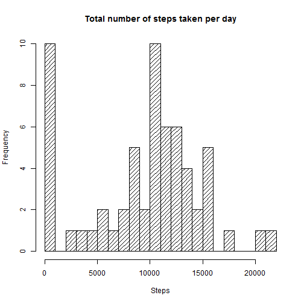
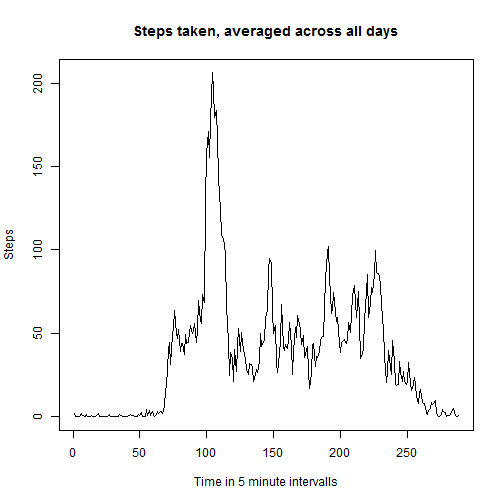
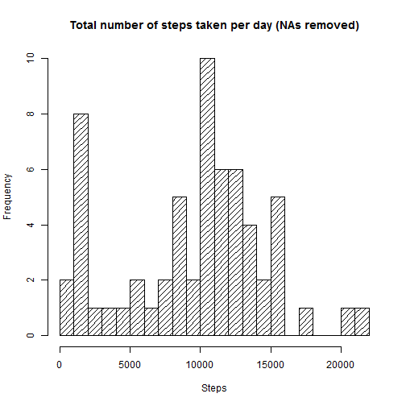
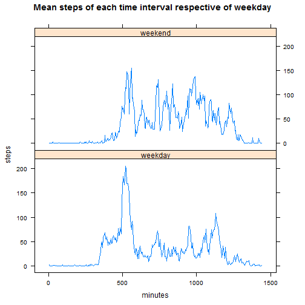

Just setting the environment


```r
setwd("C:/Users/ertls/courses/Reproducible_Research")
library(lattice)
```

    
## Loading and preprocessing the data


```r
activity <- read.csv("activity.csv")
```


## What is mean total number of steps taken per day?
    
Calculate and show a histogram of the number of steps taken per day. (NAs not removed, therefore equal to zero steps when calculating the sum.)

```r
steps_per_day <- tapply(activity$steps, activity$date, sum, na.rm = TRUE)
hist(steps_per_day, 20, main = "Total number of steps taken per day",
     xlab = "Steps", density = 15)
```

 

Summary (including the mean and the median) of the total number of steps per taken day.

```r
summary(steps_per_day)
```

```
##    Min. 1st Qu.  Median    Mean 3rd Qu.    Max. 
##       0    6778   10400    9354   12810   21190
```


## What is the average daily activity pattern?


```r
each_day <- tapply(activity$steps, activity$interval, mean, na.rm = TRUE)
plot(each_day, type = "l",
     main = "Steps taken, averaged across all days",
     xlab = "Time in 5 minute intervalls", ylab = "Steps")
```

 

The 5-minute intervall with the maximum number of steps:


```r
steps_max <- which(each_day == max(each_day))
```
104th 5 minute intervall  
835 (abc) a hours bc minutes


## Imputing missing values


```r
steps_na <- sum(is.na(activity$steps))
length_steps <- length(activity$steps)
```

There are 2304 missing values out of a total of 17568 values in the dataset (13 %).

The following code segment calculates the median of each time interval and stores it in the column activity$median.

```r
for (i in 1:288) {
    n_row <- integer(61)
    for (j in 1:61) n_row[j] <- (j-1)*288 + i
    for (k in n_row)
        activity$median[k] <- median(activity$steps[n_row], na.rm = TRUE)
}
```

Now I create a new dataset without missing values. Instead of the missing values there are now the medians of the respective time intervall.

```r
activity_median_for_na <- activity
activity_median_for_na$steps[is.na(activity$steps)] <-
    activity$median[is.na(activity$steps)]
```

Calculate and show a histogram the number of steps taken per day (this time with NAs removed).

```r
steps_per_day_na_removed <- tapply(activity_median_for_na$steps,
                                   activity$date, sum,
                        na.rm = TRUE)
hist(steps_per_day_na_removed, 20,
     main = "Total number of steps taken per day (NAs removed)",
     xlab = "Steps", density = 15)
```

 

Summary (including the mean and the median) of the total number of steps per taken day (NAs removed).

```r
summary(steps_per_day_na_removed)
```

```
##    Min. 1st Qu.  Median    Mean 3rd Qu.    Max. 
##      41    6778   10400    9504   12810   21190
```

The summary from above with NA present, to compare:

```r
summary(steps_per_day)
```

```
##    Min. 1st Qu.  Median    Mean 3rd Qu.    Max. 
##       0    6778   10400    9354   12810   21190
```

Without missing values (substituted as described above) the minimum number of steps taken per day is increased and the mean is slightly smaller.

## Are there differences in activity patterns between weekdays and weekends?

New factor variable Weekday/Weekend:

```r
activity_median_for_na$day <- factor("weekday",
                                     levels = c("weekday", "weekend"))
weekend <- (weekdays(as.Date(activity_median_for_na$date,
                             format = "%Y-%m-%d")) == "Sonntag"
            | weekdays(as.Date(activity_median_for_na$date,
                             format = "%Y-%m-%d")) == "Samstag")
activity_median_for_na$day[weekend] <- "weekend"
```

Calculating the mean steps at each time interval for weekdays and weekends.

```r
each_day <- tapply(activity_median_for_na$steps,
                   list(activity_median_for_na$interval,
                   activity_median_for_na$day), mean, na.rm = TRUE)
each_day <- data.frame(each_day)
neach_day <- data.frame()
neach_day[1:288,1] <- each_day[,1]
neach_day[289:576,1] <- each_day[,2]
neach_day[,2] <- gl(2, 288, labels = c("weekday", "weekend"))
neach_day[,3] <- 1:288
neach_day[,4] <- neach_day[,3] * 5
names(neach_day) <- c("steps", "day", "interval", "minutes")
xyplot(steps ~ minutes | day, data = neach_day, layout = c(1,2), type = "l",
       main = "Mean steps of each time interval respective of weekday")
```

 

